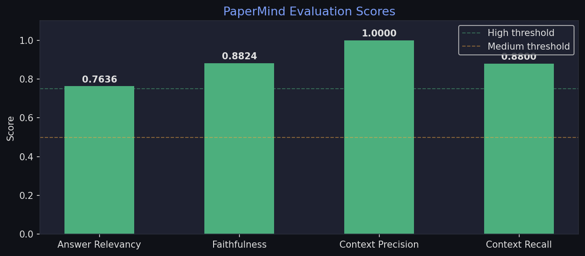
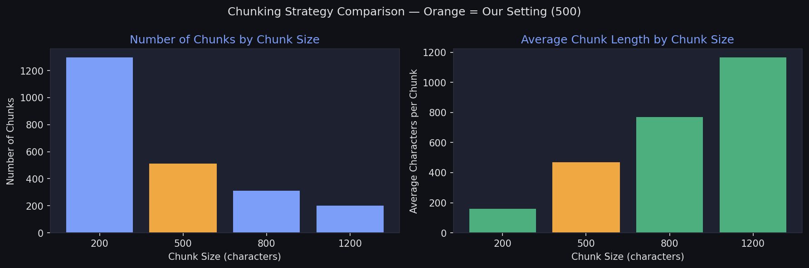
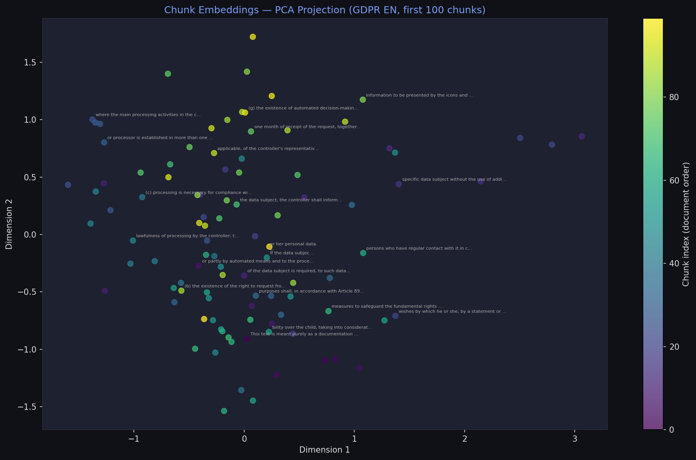
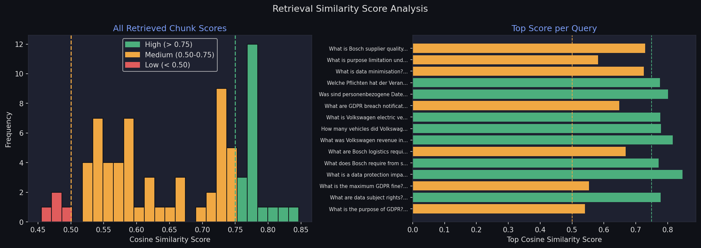

# PaperMind — Multilingual Document Intelligence System

PaperMind is a RAG (Retrieval Augmented Generation) system that lets you upload
documents in any language and ask questions about them in any language.
It retrieves the most relevant passages from your documents, generates grounded
answers using Claude, and shows exactly which document and page each answer
came from.

---

## What it does

- Upload any PDF or image/screenshot of a document
- Ask questions in any language — system responds in the same language
- Answers are grounded in your documents, not Claude's general knowledge
- Shows source attribution: document name and page number with every answer
- Side-by-side PDF viewer — select text with your mouse to ask about it
- Remembers conversation context across multi-turn questions
- Works across multiple documents simultaneously in one session

---

## Tech Stack

| Layer | Tool |
|---|---|
| LLM | Claude Sonnet (answers) + Claude Haiku (vision/routing) |
| Embeddings | paraphrase-multilingual-MiniLM-L12-v2 (local, free, 50+ languages) |
| Vector Store | ChromaDB (persistent local storage) |
| Document Loading | PyMuPDF |
| Framework | LangChain (text splitting + memory) |
| Backend | FastAPI |
| Frontend | HTML + PDF.js |
| Evaluation | Custom embedding-based pipeline |
| Deployment | Docker |
| Graph Retrieval | spaCy (NER) + NetworkX (knowledge graph) |
| Monitoring      | Prometheus + Grafana                     |

---

## Demo Documents

Four publicly available documents across different domains and languages:

| Document | Domain | Language |
|---|---|---|
| GDPR Full Text | Legal | English |
| GDPR Full Text | Legal | German |
| Bosch Supplier Manual | Technical | English |
| VW Annual Report 2023 | Financial | English |

---

## Evaluation Results

Custom embedding-based evaluation on 25 manually created QA pairs
across all 4 demo documents.

| Metric | Score | What it measures |
|---|---|---|
| Answer Relevancy | 0.7636 | Semantic similarity between question and answer |
| Faithfulness | 0.8824 | Fraction of answer sentences grounded in retrieved context |
| Context Precision | 1.0000 | Fraction of retrieved chunks relevant to the question |
| Context Recall | 0.8800 | Fraction of ground truth covered by retrieved context |



---

## RAG Exploration

The `notebooks/rag_exploration.ipynb` notebook documents the design decisions
behind the retrieval pipeline through 5 experiments:

**1. Chunking Strategy**
Tested chunk sizes of 200, 500, 800 and 1200 characters on the GDPR document.
chunk_size=200 produces 1300+ fragments too small to contain a complete thought.
chunk_size=1200 produces chunks so large that retrieved context contains too much
irrelevant text. chunk_size=500 with overlap=100 was selected as the optimal
balance — each chunk contains a complete legal clause or paragraph.



**2. Embedding Visualisation**
Embedded 100 chunks from GDPR EN using paraphrase-multilingual-MiniLM-L12-v2
and reduced 384 dimensions to 2D using PCA. The spread of points confirms the
document has semantically diverse content — chunks about consent cluster away
from chunks about enforcement, which cluster away from chunks about data subject
rights. Good spread means retrieval has meaningful signal to work with.



**3. Retrieval Quality Check**
Ran 5 test queries across all 4 documents including a German query
(Was sind die Rechte der betroffenen Personen?). Verified that the multilingual
embedding model correctly retrieves German GDPR chunks for German queries and
English chunks for English queries — both from the same vector store with no
translation step.

**4. Score Distribution**
Ran 15 queries across all documents and plotted cosine similarity distributions.
Most scores fall in the medium to high range (0.50-0.85). The 2-3 low scores
correspond to abstract concept queries where meaning is spread across multiple
chunks rather than concentrated in one. The right panel shows top score per
query — confirms every query returns at least one meaningfully relevant chunk.



**5. Evaluation Results**
Loaded scores from `artifacts/evaluation_results.json` and plotted as a bar
chart. All 4 metrics are in the High confidence zone (above 0.75), with
Context Precision hitting 1.0 - every retrieved chunk was relevant to the
question being asked.

---

## GraphRAG Extension

Extended PaperMind with a graph-based retrieval layer benchmarked
against vector retrieval using the same evaluation pipeline.

**Approach:** spaCy NER extracts named entities from every ingested
chunk. Entity pairs co-occurring in the same sentence are connected
as edges in a NetworkX knowledge graph. At query time, entities are
extracted from the question and the graph is traversed 2 hops to
retrieve connected chunks. The graph updates incrementally on every
new document ingested — no full rebuild needed.

**Benchmark — vector vs graph retrieval (25 single-fact + 8 multi-hop QA pairs):**

| Question Type | Method | Faithfulness | Context Precision |
|---|---|---|---|
| Single-fact | Vector | 0.7332 | 1.0000 |
| Single-fact | Graph  | 0.4667 | 0.2240 |
| Multi-hop   | Vector | 0.7456 | 1.0000 |
| Multi-hop   | Graph  | 0.6619 | 0.2500 |

**Finding:** Vector retrieval outperformed graph retrieval on both
metrics across both question types. Graph retrieval's coverage
collapsed on 44% of single-fact queries due to entity-matching
brittleness — legal and financial documents reference the same
concept inconsistently across sentences, which breaks naive
co-occurrence graphs. Entity resolution was identified as the key
bottleneck. This is a correctly scoped negative result: dense
embedding retrieval is the stronger default for this document corpus.

---

## Monitoring

PaperMind exposes a `/metrics` endpoint instrumented with
`prometheus-fastapi-instrumentator`. Prometheus scrapes every 5
seconds; Grafana visualizes in real time.

**Dashboard panels:** request latency (p95) · requests per minute ·
error rate · service uptime

```bash
docker compose -f docker-compose.monitoring.yml up -d
```

Open Grafana at `http://localhost:3000` (admin / admin),
add Prometheus data source at `http://prometheus:9090`.

---

## Setup

**1. Clone and create environment**
```bash
git clone https://github.com/dixitdevarshi/PaperMind.git
cd PaperMind
conda create -n papermind python=3.10 -y
conda activate papermind
pip install -r requirements.txt
```

**2. Add your API key**
```bash
echo ANTHROPIC_API_KEY=your_key_here > .env
```

**3. Run**
```bash
uvicorn app:app --reload
```

Open `http://localhost:8000` in your browser.

---

<!-- ## API Endpoints

| Method | Endpoint | Description |
|---|---|---|
| POST | `/ingest/pdf` | Upload and process a PDF |
| POST | `/ingest/image` | Upload and process an image via Claude Vision |
| POST | `/query` | Ask a question |
| POST | `/query/stream` | Streaming version of /query |
| POST | `/query/selection` | Ask about text selected in the PDF viewer |
| GET | `/documents` | List all ingested documents |
| DELETE | `/documents/{name}` | Remove a document |
| GET | `/health` | Health check |
| GET | `/evaluate` | Run evaluation |
| GET | `/metrics` | Prometheus metrics endpoint |
| GET | `/docs` | Auto-generated Swagger UI | -->

<!-- ---

## Docker

```bash
docker build -t papermind .
docker run -p 8000:8000 --env-file .env papermind -->
```

